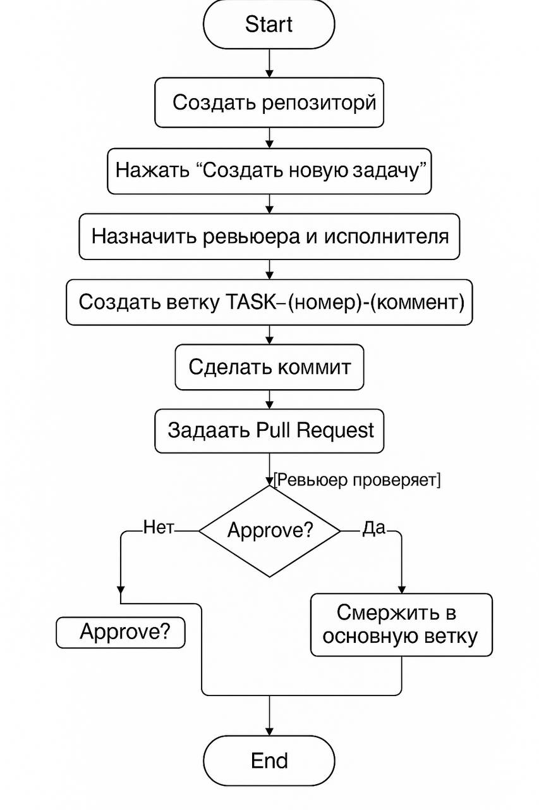
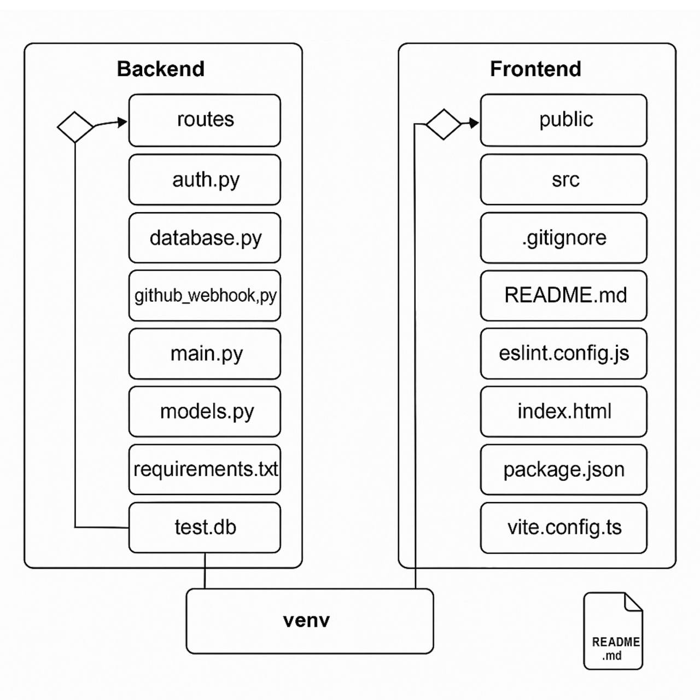

# Task Tracker с интеграцией GitHub 🚀


## 📋 Описание

Task Tracker - это современное веб-приложение для эффективного отслеживания задач с глубокой интеграцией GitHub. Приложение позволяет автоматически обновлять статус задач на основе GitHub коммитов и pull request'ов, делая процесс управления проектами более прозрачным и автоматизированным.

## ✨ Ключевые возможности

- **Управление задачами**: создание, редактирование и отслеживание задач
- **Интеграция с GitHub**: авторизация через GitHub OAuth
- **Автоматизация**:
  - Автоматическое обновление статуса задач при упоминании их в коммитах (статус → "done")
  - Автоматическое закрытие задач при упоминании их в merged pull request'ах (статус → "closed")
- **Система баллов**: начисление баллов пользователям за закрытые задачи
- **Персональный профиль**: история задач и заработанные баллы для каждого пользователя
- **Адаптивный дизайн**: работает на всех устройствах

## 🛠️ Технологии

### Backend
- **FastAPI** - высокопроизводительный Python фреймворк
- **SQLAlchemy** - ORM для работы с базой данных
- **JWT аутентификация** - безопасный механизм авторизации
- **GitHub OAuth и API** - интеграция с GitHub экосистемой

### Frontend
- **React** - библиотека для создания пользовательских интерфейсов
- **TypeScript** - типизированный JavaScript для более безопасной разработки
- **React Router** - маршрутизация в приложении
- **React Query** - эффективное управление состоянием данных
- **Tailwind CSS** - утилитарный CSS фреймворк для стилизации

## 📋 Требования

- Python 3.8+
- Node.js 16+
- npm/yarn
- Git

## Архитектура





## 🚀 Установка и запуск

### Подготовка рабочего пространства

1. Создание виртуального окружения:
   ```bash
   python3 -m venv venv
   ```

2. Активация виртуального окружения:
   ```bash
   source venv/bin/activate
   ```

### Backend

1. Перейдите в директорию backend:
   ```bash
   cd backend
   ```

2. Установите зависимости:
   ```bash
   pip install -r requirements.txt
   ```

3. База данных SQLAlchemy
   В проекте используется SQLAlchemy как ORM для работы с базой данных SQLite. 
   База данных инициализируется автоматически при первом запуске.
   Конфигурация находится в файле `database.py`:
   - URL подключения: `sqlite:///./test.db`
   - Автоматическое создание таблиц при старте
   - Асинхронная работа с базой данных через `databases`

4. Запуск backend сервера:
   ```bash
   python3 -m uvicorn main:app
   ```
   Сервер будет доступен по адресу: http://localhost:8000

5. Для доступа к серверу через интернет:
   ```bash
   ssh -R 80:localhost:8000 serveo.net
   ```

### Frontend

1. Перейдите в директорию frontend:
   ```bash
   cd frontend
   ```

2. Установите зависимости:
   ```bash
   npm i
   ```

3. Запустите приложение:
   ```bash
   npm run dev
   ```
   Frontend будет доступен по адресу: http://localhost:5173

## 💻 Использование

### Авторизация

Для начала работы авторизуйтесь через GitHub, нажав на кнопку "Login with GitHub". Это обеспечивает безопасный доступ к функционалу приложения и позволяет отслеживать ваши задачи и прогресс.

### Работа с задачами

1. **Создание задачи**:
   - Нажмите "Create Task" в навигационном меню
   - Заполните форму с деталями задачи:
     - Название задачи
     - Подробное описание
     - Исполнитель задачи
     - GitHub пользователь (для интеграции)
     - Количество баллов за выполнение
     - GitHub репозиторий (опционально)

2. **Управление задачами**:
   - Просмотр всех задач в разделе "Tasks"
   - Фильтрация по статусу, исполнителю и другим параметрам
   - Возможность редактирования и удаления задач

3. **Профиль пользователя**:
   - Просмотр истории задач в разделе "Profile"
   - Отслеживание заработанных баллов
   - Статистика выполненных задач

## 🔄 Интеграция с GitHub

### Обновление статуса задачи через коммит

Для автоматического обновления статуса задачи, включите ID задачи в формате `TASK-123` в сообщение коммита:

```bash
git commit -m "Исправлен баг в функции X [TASK-123]"
```

После пуша коммита в репозиторий GitHub, задача автоматически получит статус "done".

### Закрытие задачи через Pull Request

Для автоматического закрытия задачи, включите ID задачи в формате `TASK-123` в описание pull request'а:

```
Этот PR добавляет функциональность X и исправляет баг Y.
Closes [TASK-123]
```

Когда PR будет принят и слит с основной веткой, задача получит статус "closed", а исполнителю будут начислены указанные в задаче баллы.

## ⚙️ Настройка Webhook

Для работы автоматического обновления статуса задач, необходимо настроить webhook в GitHub репозитории:

1. Перейдите в настройки репозитория на GitHub
2. Выберите "Webhooks" → "Add webhook"
3. Укажите URL: `https://ваш-домен.com/webhook`
4. В качестве Content type выберите `application/json`
5. Выберите события (events): "Push" и "Pull requests"
6. Сохраните настройки

## 📊 API документация

API документация доступна по адресу `http://localhost:8000/docs` после запуска backend сервера.

## 🌟 Реализованные требования проекта

В рамках проекта были успешно реализованы следующие фичи и требования:

### 📋 Обязательные требования:
- **Оформленное README проекта** - подробное описание, инструкции по развертыванию, визуальные элементы
- **Структурированный проект** - чёткое разделение frontend и backend, правильная организация директорий
- **Подробная документация** - описание API, структуры кода, руководство пользователя
- **Применение ООП** - использование классов и объектно-ориентированных подходов в архитектуре проекта

### 🚀 Дополнительные фичи:
- **Работа с файлами** - загрузка и хранение файлов через API
- **Интеграция со сторонними API** - полноценная интеграция с GitHub API для авторизации и работы с репозиториями
- **Реализация системы конфигураций** - настройка через переменные окружения и конфигурационные файлы
- **Графический интерфейс** - современный React-интерфейс с адаптивным дизайном
- **REST API** - полноценный API с многочисленными endpoint'ами для работы с задачами и пользователями
- **Работа с базой данных** - структурированная БД с использованием SQLAlchemy ORM
- **Многопоточность и асинхронность** - асинхронная обработка запросов и webhooks через FastAPI
- **Типизация** - строгая типизация в Python и TypeScript
- **Логирование** - система логирования действий пользователей и API запросов

## 📝 Лицензия

Этот проект распространяется под лицензией MIT. Подробности в файле LICENSE.

## ✍️ Автор

Пищулина Анна БИВТ-24-17

### Ссылка на презентацию 
https://docs.google.com/presentation/d/1Ptl_PK9BSEwbAWLGTM0MS233oG73Qzzu/edit?usp=sharing&ouid=107467571569428818548&rtpof=true&sd=true

